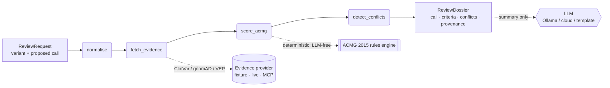

# Reviewer2


**An AI second-reviewer for germline ACMG/AMP variant classification.**

Clinical genetics labs are required by CAP/CLIA to put every variant call through a second reviewer before it reaches a patient report. That reviewer is checking whether the ACMG criteria were applied correctly and whether the evidence still holds. The problem is that evidence moves. ClinVar submitters disagree. "Pathogenic" calls get quietly downgraded. VUS get reclassified months before any pipeline re-pulls them. A human working from a static report never sees any of that.

Reviewer2 takes a variant and a proposed classification, independently re-derives the ACMG call from current evidence, and tells you exactly where the two calls differ and why — with the specific source sentence behind every criterion it fires. It does not replace the second reviewer. It makes sure the second reviewer is looking at the right thing.

---

## What it catches

Three real error classes, reproduced by `make demo` with no API keys:

**Stale evidence.** A BRCA1 frameshift called Uncertain significance 818 days ago. ClinVar has since accumulated expert-panel evidence placing it firmly Pathogenic. The pipeline never re-ran. Reviewer2 re-derives the call as Pathogenic, flags the staleness, and blocks sign-off.

**Overcall on a common variant.** A PCSK9 variant proposed as Likely pathogenic. gnomAD shows it at population frequency well above the BA1/BS1 threshold — it should be Benign. Reviewer2 catches the direction error.

**Undercall of a null variant.** A TP53 stop-gain absent from gnomAD, proposed as VUS. PVS1 at Very Strong plus PM2 at Moderate independently reaches Pathogenic. Reviewer2 flags it as a cross-band undercall.

```
$ make demo

 BRCA1 c.5266dupC / p.Gln1756fs  GRCh38:17:43094692
 ─────────────────────────────────────────────────────
 Independent call : Pathogenic
 Proposed call    : Uncertain significance
 Disagreement     : CRITICAL — crosses the clinical action boundary (act vs. monitor)

 Criteria fired
  PVS1 [Very Strong]  frameshift in LoF-intolerant gene BRCA1
  PM2  [Moderate]     gnomAD AF 0.00e+00 — below rare threshold 1e-04
  PS1  [Strong]       same amino-acid change as known ClinVar pathogenic variant

 Conflicts flagged
  CLASSIFICATION_DISAGREEMENT [CRITICAL]
    Reviewer2 call Pathogenic vs proposed Uncertain significance — different
    clinical action bands. Proposed call must be reviewed before sign-off.
  STALE_EVIDENCE [MAJOR]
    ClinVar record is 818 days old relative to retrieval. This call may predate
    a reclassification.
```

---

## What makes this different

**The classification is deterministic, not LLM-generated.** The ACMG 2015 combining rules (Richards et al., Table 5) are implemented directly in Python. The LLM has no role in the verdict — it can optionally polish the prose summary, but the same inputs always produce the same classification. This is auditable and reproducible in a way that an end-to-end LLM approach is not.

**Every criterion is grounded in a source quote.** A Pydantic validator makes it a runtime error to fire any criterion without an attached evidence item carrying the literal sentence from the source. A reviewer can verify any claim without trusting a model.

**It reports false-positive rate, not just catch rate.** Most genomics tools only report sensitivity. Reviewer2 ships with ErrorCatch, an evaluation harness that injects known errors and measures both the catch rate and the rate of blocking correct calls unnecessarily. An AI second-reviewer that generates noise is worse than no second-reviewer at all.

---

## Evaluation

### ErrorCatch — does it flag the right errors?

| Error type | Caught |
|---|:---:|
| Stale ClinVar record (call made before reclassification) | 2 / 2 |
| ClinVar submitter conflict hidden by a single proposed call | 1 / 1 |
| Overcall on a common variant (BA1/BS1 should fire) | 2 / 2 |
| Undercall on a null variant in a LoF-intolerant gene | 2 / 2 |
| In-silico evidence applied in the wrong direction | 1 / 1 |
| **Total** | **8 / 8 (95% CI 68%–100%)** |

False-positive rate on 4 correct controls: **0% (95% CI 0%–49%)**

ErrorCatch measures flagging behavior, not classification accuracy. The wide CIs reflect sample size honestly — this is a methodology demonstration. The test set is fully inspectable in `eval/errorcatch_testset.json`.

Reproduced by `make eval`.

### Concordance — does the engine agree with expert panels?

This is the harder question: given only population and computational evidence, does the engine's independent ACMG call match expert-panel (ClinGen VCEP / 3-star ClinVar) classifications it never saw?

| Metric | Result | 95% CI |
|---|:---:|:---:|
| Action-band concordance | 86% | 60%–96% |
| In-scope exact concordance | 82% | 52%–95% |
| Exact concordance (5-tier, all 14 cases) | 64% | 39%–84% |

"In-scope" means the 11 of 14 cases the v1 engine is designed to handle. The 3 out-of-scope misses are variants where the expert call rests on functional assay (PS3) or segregation (PP1) data — criteria v1 does not implement because no public API provides that data. Those cases are included in the denominator, not hidden.

No in-scope case crosses the clinical action boundary in the wrong direction.

Reproduced by `make concordance`.

---

## Technology stack

| Layer | Technology | Where |
|---|---|---|
| Agentic graph | LangGraph `StateGraph` | `pipeline.py` — 4-node graph, typed `ReviewState`, compiled and invoked |
| LLM integration | Ollama · Anthropic · OpenAI · Gemini | `llm.py` — provider-agnostic protocol, graceful fallback to deterministic template |
| MCP server | FastMCP (Model Context Protocol) | `mcp_server/server.py` — `get_evidence` and `review_variant_tool` on stdio transport |
| Retrieval layer | Pluggable `EvidenceProvider` protocol | `evidence.py` — fetch node pulls from ClinVar / gnomAD / VEP; same seam as a RAG retriever |
| Typed domain | Pydantic v2 with model validators | `models.py` — validator enforces "no criterion fired without attached evidence" at runtime |
| Deterministic reasoning | Pure Python rules engine | `acmg/rules.py` — Richards 2015 Table 5; `acmg/scorer.py` — ClinGen SVI PVS1 decision tree |
| CLI | Typer + Rich | `cli.py` — `reviewer2 review` and `reviewer2 demo` |
| Evaluation | Custom harness | `eval/errorcatch.py` + `eval/concordance.py` |

**MCP as a producer, not just a consumer.** Most genomics code calls external APIs. This repo ships an MCP server so that any MCP-aware agent — Claude Desktop, VS Code Copilot, a LangGraph orchestrator — can call the gnomAD/ClinVar evidence fetch and the full ACMG second-review as first-class tools.

**Providers injected throughout.** Both the evidence provider and the LLM client are injected into the LangGraph graph at build time. The eval runs fully offline and deterministically with no API keys. Swapping in a live ClinVar/gnomAD provider is a one-line change.

---

## How it works



**Action-band conflict gating.** Pathogenic and Likely pathogenic lead to the same clinical management. Reviewer2 only raises a blocking disagreement when two calls fall in different clinical action bands (act / monitor / do not act). A P-vs-LP difference is recorded but does not block sign-off — because the most damaging thing a second-reviewer can do is generate noise.

**Provenance hash.** Every dossier carries a `sha256[:16]` over the variant, evidence fingerprint, fired criteria, and engine version. Identical inputs produce an identical hash, enforced by a test.

---

## Quick start

```bash
git clone https://github.com/ankurgenomics/Reviewer2.git
cd Reviewer2

uv sync                 # installs from the committed lockfile
make demo               # 3 cases offline, no API keys needed
make eval               # ErrorCatch
make concordance        # concordance vs expert-panel ClinVar
make test               # 21 tests
make lint && make typecheck
```

Review a specific variant:

```bash
uv run reviewer2 review \
    --chrom 17 --pos 43094692 --ref A --alt AC --gene BRCA1 \
    --proposed uncertain_significance
```

With a local or cloud LLM for the prose summary (classification stays deterministic):

```bash
uv run reviewer2 demo --llm ollama

uv sync --extra cloud
REVIEWER2_LLM_PROVIDER=anthropic ANTHROPIC_API_KEY=<key> uv run reviewer2 demo
```

---

## MCP server

```bash
uv sync --extra mcp
make mcp
```

Tools: `get_evidence(variant)` returns structured gnomAD/ClinVar/VEP evidence with source quotes. `review_variant_tool(variant, proposed_classification)` returns the full dossier as JSON.

Point an MCP host at `uv run python -m mcp_server.server`.

---

## What the engine implements

| Criterion | Source | Strength |
|---|---|:---:|
| PVS1 | VEP consequence + gene | Very Strong (default); downgraded by NMD/transcript context |
| PS1 | ClinVar same amino-acid change | Strong |
| PM2 | gnomAD popmax AF | Moderate |
| PP3 | Ensemble in-silico score >= 0.7 | Supporting |
| BP4 | Ensemble in-silico score <= 0.3 | Supporting |
| BA1 | gnomAD AF > 5% | Stand-alone Benign |
| BS1 | 1% < gnomAD AF <= 5% | Strong |

Criteria requiring functional assay data (PS3/BS3), segregation (PP1/BS4), or de novo status (PM6/PS2) are not in v1 — the data is not available from public APIs. The concordance eval includes these cases and reports them as known blind spots.

---

## Project layout

```
src/reviewer2/
  models.py       — typed domain: Variant, EvidenceItem, ACMGCriterion, ReviewDossier
  acmg/
    rules.py      — ACMG 2015 Table 5 combining rules (deterministic, LLM-free)
    scorer.py     — evidence → fired criteria (PVS1 SVI tree, PM2, PS1, PP3/BP4, BA1/BS1)
  conflicts.py    — detect_conflicts: classification disagreement, stale evidence, submitter conflict
  pipeline.py     — 4-node LangGraph graph (normalise → fetch → score → detect)
  evidence.py     — EvidenceProvider protocol + fixture / live providers
  llm.py          — provider-agnostic LLM client (template / Ollama / cloud), never crashes
  summary.py      — deterministic prose + provenance_hash
  cli.py          — Typer + Rich CLI

eval/
  errorcatch.py / errorcatch_testset.json   — flagging behavior harness
  concordance.py / concordance_testset.json — accuracy vs expert-panel ClinVar
  fixtures/evidence.json                    — offline evidence for demo cases

mcp_server/server.py   — FastMCP server
tests/                 — 21 pytest tests
```

---

## Scope and limitations

Germline ACMG/AMP only. Somatic tiering (AMP/ASCO/CAP) is not in scope for v1.

Evidence in v1 comes from offline fixtures. `LiveEvidenceProvider` in `evidence.py` marks exactly where ClinVar, gnomAD, and VEP calls plug in — that is v1.1 work.

Not a clinical device. Not validated for diagnostic use. Must not drive patient care without qualified human sign-off.

---

## License

MIT
