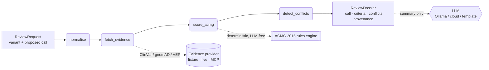

# Reviewer2


A second-reviewer tool for germline ACMG/AMP variant classification. It independently re-derives
the ACMG call from structured evidence, grounds every fired criterion in a literal source quote,
and flags where the proposed classification disagrees with current data.

Clinical labs already run a second reviewer on variant calls — it is required by CAP/CLIA. The
problem is that the evidence underneath a variant changes constantly. ClinVar submitters disagree,
"pathogenic" calls get downgraded, VUS get reclassified months before anyone re-pulls them. A human
reviewer working from a static report misses all of that. This tool does not replace the human; it
makes the human faster and harder to fool.

```
$ make demo

 BRCA1 c.5266dupC / p.Gln1756fs  GRCh38:17:43094692
 Independent call : Pathogenic
 Proposed call    : Uncertain significance
 Disagreement     : CRITICAL — crosses the clinical action boundary (act vs. monitor)

 Criteria fired
  PVS1 [Very Strong]  frameshift in LoF-intolerant gene BRCA1
  PM2  [Moderate]     gnomAD AF 0.00e+00 — below rare threshold 1e-04
  PS1  [Strong]       same amino-acid change as known ClinVar pathogenic variant

 Conflicts flagged
  CLASSIFICATION_DISAGREEMENT [CRITICAL]
    Reviewer2 call Pathogenic vs proposed Uncertain significance; different
    clinical action bands. Proposed call needs review before sign-off.
  STALE_EVIDENCE [MAJOR]
    ClinVar record is 818 days old relative to retrieval. May have been
    reclassified since the proposed call was made.
```

---

## Technology stack

| Layer | Technology | Where in the code |
|---|---|---|
| **Agentic graph** | LangGraph `StateGraph` | `pipeline.py` — 4-node graph, typed `ReviewState`, compiled and invoked |
| **LLM integration** | Ollama · Anthropic · OpenAI · Gemini | `llm.py` — provider-agnostic `LLMClient` protocol, graceful fallback to deterministic template |
| **MCP server** | FastMCP (Model Context Protocol) | `mcp_server/server.py` — two registered tools (`get_evidence`, `review_variant_tool`) on stdio transport; any MCP-aware agent can call them |
| **Retrieval layer** | Pluggable `EvidenceProvider` protocol | `evidence.py` — fetch node retrieves structured evidence from ClinVar / gnomAD / VEP; the seam is identical to a RAG retriever |
| **Typed domain** | Pydantic v2 with model validators | `models.py` — `ReviewRequest`, `EvidenceItem`, `ACMGCriterion`, `ReviewDossier`; a validator enforces "no criterion fired without attached evidence" at runtime |
| **Deterministic reasoning** | Pure Python rules engine | `acmg/rules.py` — Richards 2015 Table 5, LLM-free; `acmg/scorer.py` — ClinGen SVI decision tree for PVS1 strength |
| **CLI** | Typer + Rich | `cli.py` — `reviewer2 review` and `reviewer2 demo` |
| **Evaluation** | Custom harness | `eval/errorcatch.py` (flagging behavior) + `eval/concordance.py` (accuracy vs expert panel) |

### Design decisions worth noting

**LLM role is strictly bounded.** The classification verdict comes from the deterministic rules engine. The LLM only polishes the human-readable summary. This makes the output reproducible, auditable, and independent of which LLM provider is available.

**MCP as a producer, not just a consumer.** Most genomics code calls external APIs. This repo ships an MCP server so that other agents — Claude Desktop, VS Code Copilot, a LangGraph agent — can call the gnomAD/ClinVar tools and the full ACMG second-review as first-class tools.

**Retrieval is structured, not semantic.** The `EvidenceProvider` protocol is the retrieval layer in a RAG pattern. Evidence items carry a literal `source_quote` field so every claim is grounded in the original source text. Semantic search over PubMed is explicitly deferred to v1.1 — the retriever seam is already in place to plug it in.

**Providers are injected throughout.** Both the evidence provider and the LLM client are injected into the graph at build time. This is why the eval runs fully offline and deterministically without any API keys, and why swapping in a live ClinVar/gnomAD provider is a one-line change.

---

## How it works



The classification is deterministic and LLM-free. The engine implements Richards et al. (2015)
Table 5 combining rules directly — PVS/PS/PM/PP/BA/BS/BP counts, contradictory evidence resolves
to VUS. An LLM can optionally polish the human-readable summary, but it cannot touch the verdict.

Three ideas do the structural work:

**No claim without a source.** A Pydantic validator makes it a runtime error to mark a criterion
as met without an attached evidence item. Every evidence item carries the literal sentence from
the source. A reviewer can verify any claim in under a minute.

**Action-band conflict gating.** Pathogenic and Likely pathogenic lead to the same clinical
management. The tool only raises a blocking disagreement when two calls fall in different bands
(act / monitor / do not act). A P-vs-LP difference is recorded but does not block sign-off. This
matters because the most costly thing a second reviewer can do is generate noise.

**Provenance hash.** Every dossier carries a `sha256[:16]` over the variant, evidence fingerprint,
fired criteria, and engine version. Identical inputs produce an identical hash, which is enforced
by a test. You can audit any dossier and reproduce it.

---

## Evaluation

### ErrorCatch

ErrorCatch asks a specific question: given a variant with an injected classification error, does
the second-reviewer flag it? It does not measure whether the engine's independent call is
clinically correct — that is what the Concordance eval below is for. The two evals are kept
separate on purpose.

The test set has 8 injected errors and 4 correct controls. The injected errors cover the five
error classes most common in real variant interpretation workflows.

| Error type | Caught |
|---|:---:|
| Stale ClinVar record (call made before reclassification) | 2 / 2 |
| ClinVar submitter conflict hidden by a single proposed call | 1 / 1 |
| Overcall on a common variant (BA1/BS1 should fire) | 2 / 2 |
| Undercall on a null variant in a LoF-intolerant gene | 2 / 2 |
| In-silico evidence applied in the wrong direction | 1 / 1 |
| **Total** | **8 / 8 (95% CI 68%–100%)** |

False-positive rate on 4 correct controls: **0% (95% CI 0%–49%)**

The wide CI on both numbers reflects the sample size. This is a methodology demonstration, not
a published benchmark. The test set is hand-curated, fully inspectable, and self-contained in
`eval/errorcatch_testset.json`.

Reproduced by `make eval`. Results written to `eval/results/errorcatch.json`.

### Concordance

Concordance measures accuracy against an external gold standard — expert-panel (ClinGen VCEP /
3-star ClinVar) classifications that the engine never sees. This is the harder question: given
only population and computational evidence, does the engine agree with the expert?

| Metric | Result | 95% CI |
|---|:---:|:---:|
| Exact concordance (5-tier) | 64% | 39%–84% |
| Action-band concordance | 86% | 60%–96% |
| In-scope exact concordance | 82% | 52%–95% |

"In-scope" means the 11 of 14 cases the v1 engine is designed to handle. The 3 out-of-scope
cases are pathogenic by functional assay (PS3) or segregation (PP1) alone — criteria v1 does
not implement because no public API provides the data. Those are reported honestly rather than
hidden from the denominator.

The 18% exact miss rate on in-scope cases breaks down as: two B/LB calls where the engine
reaches LB/LP instead of the expert's B/P (same action band, one-tier miss). No in-scope case
crosses the clinical action boundary in the wrong direction.

Reproduced by `make concordance`. Results written to `eval/results/concordance.json`.

---

## Quick start

```bash
git clone <repo>
cd reviewer2

uv sync                 # installs from the committed lockfile — fully reproducible
make demo               # 3 offline fixture cases, no API keys needed
make eval               # ErrorCatch: 8/8 caught, 0% false positives
make concordance        # concordance vs expert-panel ClinVar
make test               # 21 tests
make lint               # ruff
make typecheck          # mypy, 12 source files
```

To review a specific variant:

```bash
uv run reviewer2 review \
    --chrom 17 --pos 43094692 --ref A --alt AC --gene BRCA1 \
    --proposed pathogenic
```

Use a local LLM to polish the prose summary (the classification itself stays deterministic):

```bash
# requires Ollama running locally
uv run reviewer2 demo --llm ollama

# or a cloud provider
uv sync --extra cloud
REVIEWER2_LLM_PROVIDER=anthropic ANTHROPIC_API_KEY=<key> uv run reviewer2 demo
```

---

## MCP server

The gnomAD/ClinVar tools are also exposed as an MCP server, so any MCP-aware agent can call
them directly.

```bash
uv sync --extra mcp
make mcp                # starts on stdio transport
```

Tools exposed: `get_evidence(variant)` and `review_variant(variant, proposed_classification)`.

Wire it into an MCP host by pointing the host at `uv run python -m mcp_server.server`.

---

## What the engine implements

| Criterion | Data source | Strength used |
|---|---|:---:|
| PVS1 | VEP consequence + gene | Very Strong (default); Strong / Moderate / Supporting if NMD/transcript hints present |
| PS1 | ClinVar same amino-acid change | Strong |
| PM2 | gnomAD popmax AF | Moderate |
| PP3 | Ensemble in-silico score >= 0.7 | Supporting |
| BP4 | Ensemble in-silico score <= 0.3 | Supporting |
| BA1 | gnomAD AF > 5% | Stand-alone Benign |
| BS1 | 1% < gnomAD AF <= 5% | Strong |

Criteria that need functional assay data (PS3/BS3), segregation (PP1/BS4), or de novo status
(PM6/PS2) are not implemented in v1. The evidence is not available from public population
databases. The concordance eval includes cases where those criteria drive the expert call, and
reports them as known blind spots.

---

## Project layout

```
src/reviewer2/
  models.py       — typed domain: Variant, EvidenceItem, ACMGCriterion, ReviewDossier
  acmg/
    rules.py      — ACMG 2015 Table 5 combining rules (deterministic, LLM-free)
    scorer.py     — evidence → fired criteria (PVS1 SVI tree, PM2, PS1, PP3/BP4, BA1/BS1)
  conflicts.py    — detect_conflicts: classification disagreement, stale evidence, submitter conflict
  pipeline.py     — 4-node LangGraph graph (normalise → fetch → score → detect)
  evidence.py     — EvidenceProvider protocol + fixture / live / MCP providers
  llm.py          — provider-agnostic LLM client (template / Ollama / cloud), never crashes
  summary.py      — deterministic prose + provenance_hash
  cli.py          — Typer + Rich CLI (reviewer2 review / demo)

eval/
  errorcatch.py          — catch-rate + false-positive-rate harness
  errorcatch_testset.json
  concordance.py         — concordance vs expert-panel ClinVar gold standard
  concordance_testset.json
  results/               — errorcatch.json, concordance.json (regenerated by make eval/concordance)
  fixtures/
    evidence.json        — offline evidence for the 3 demo variants

mcp_server/server.py     — FastMCP server: get_evidence + review_variant_tool
tests/                   — 21 pytest tests (rules, pipeline, eval)
```

---

## Toolchain

`uv` for dependency management, committed lockfile for reproducibility. `ruff` for linting,
`mypy` for type checking, `pytest` for tests. All pass clean. `langgraph` for the graph,
`pydantic v2` for the typed domain, `typer` + `rich` for the CLI.

Optional cloud LLM extras (`anthropic`, `openai`, `gemini`) are all isolated behind extras
so the default install stays lean and offline-capable.

---

## Scope and honest limitations

This is a germline-only tool. Somatic (AMP/ASCO/CAP) tiering uses a different rubric and is
not in scope.

Evidence in v1 comes from offline fixtures or the live provider stub. The `LiveEvidenceProvider`
in `evidence.py` marks exactly where ClinVar, gnomAD, and VEP API calls plug in. That is v1.1
work.

The eval sets are hand-curated and small. They demonstrate the methodology and are honest about
their size. A production system would need a stratified set drawn from ClinVar conflicting
interpretations at scale.

Not a clinical device. Not validated for diagnostic use. Should not drive patient care without
qualified human sign-off.

---

## License

MIT
