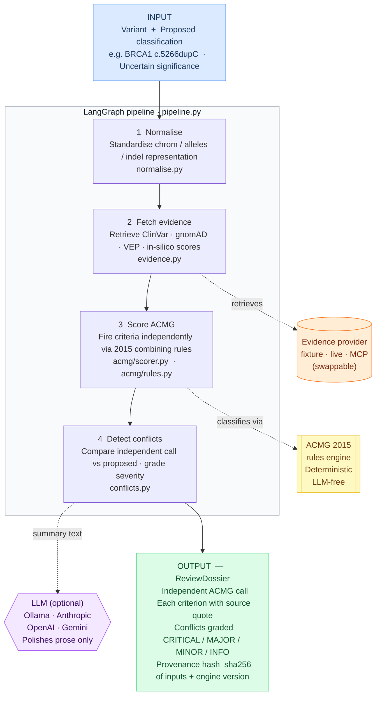
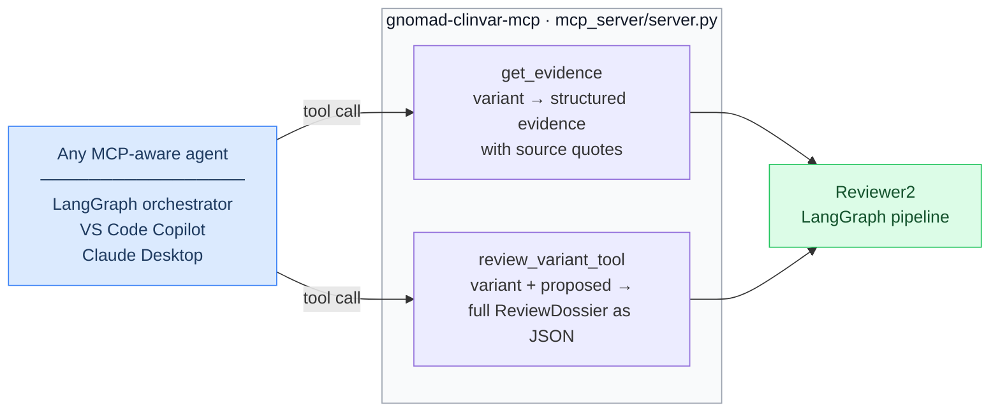

<div align="center">

<h1>Reviewer2</h1>

<p><em>Named after the notorious anonymous peer reviewer who always finds the flaw.<br>In clinical genetics, missing one matters.</em></p>

<p>
  
  &nbsp;
  
  &nbsp;
  
  &nbsp;
  
  &nbsp;
  
</p>

<p>
  
  &nbsp;
  
  &nbsp;
  
  &nbsp;
  
</p>

<br>

<p>
  <a href="#the-problem">Problem</a> &nbsp;•&nbsp;
  <a href="#what-it-catches">What it catches</a> &nbsp;•&nbsp;
  <a href="#evaluation">Evaluation</a> &nbsp;•&nbsp;
  <a href="#technology-stack">Tech stack</a> &nbsp;•&nbsp;
  <a href="#how-it-works">How it works</a> &nbsp;•&nbsp;
  <a href="#quick-start">Quick start</a>
</p>

</div>

<div align="center">
  
</div>

---

**Reviewer2 is an autonomous second-reviewer for germline ACMG/AMP variant classification.** It takes a variant and a proposed clinical classification, independently re-derives the ACMG call from current evidence using a deterministic rules engine, and tells you exactly where the calls differ — with the specific source sentence grounding every criterion it fires.

<br>

<div align="center">

| Errors caught | False-positive rate | Expert-panel concordance | Runs offline |
|:---:|:---:|:---:|:---:|
| **8 / 8** | **0%** | **82% in-scope** | **no API keys needed** |

</div>

---

## The problem

Clinical genetics labs are required by CAP/CLIA to put every variant call through a second reviewer before it reaches a patient report. The reviewer checks whether ACMG criteria were applied correctly and whether the evidence still holds.

The problem is that evidence moves. ClinVar submitters disagree. "Pathogenic" calls get quietly downgraded. VUS get reclassified months before any pipeline re-pulls them. A human working from a static report never sees any of that — and the call that was correct two years ago may be wrong today.

Reviewer2 does not replace the human reviewer. It makes sure the reviewer is looking at the right thing.

---

## What it catches

Three real error classes, reproduced by `make demo` with no API keys:

**Stale evidence.** A BRCA1 frameshift called Uncertain significance 818 days ago. ClinVar has since accumulated expert-panel evidence placing it firmly Pathogenic. The pipeline never re-ran. Reviewer2 re-derives the call as Pathogenic, flags the staleness, and blocks sign-off.

**Direction error on a common variant.** A PCSK9 variant proposed as Likely pathogenic. gnomAD shows it at population frequency well above the BA1/BS1 threshold — it should be Benign. Reviewer2 catches the direction error and flags it as CRITICAL.

**Undercall of a null variant.** A TP53 stop-gain absent from gnomAD, proposed as VUS. PVS1 at Very Strong strength plus PM2 at Moderate independently reaches Pathogenic. Reviewer2 flags it as a cross-band undercall.

```
$ make demo

  BRCA1 c.5266dupC / p.Gln1756fs  ·  GRCh38 17:43094692
  ─────────────────────────────────────────────────────────
  Independent call  Pathogenic
  Proposed call     Uncertain significance
  Disagreement      CRITICAL — crosses the clinical action boundary

  Criteria fired
    PVS1  Very Strong   frameshift in LoF-intolerant gene BRCA1
    PM2   Moderate      gnomAD AF 0.00e+00 — absent from population
    PS1   Strong        same amino-acid change as known Pathogenic variant in ClinVar

  Conflicts flagged
    CLASSIFICATION_DISAGREEMENT  [CRITICAL]
      Independent call Pathogenic vs proposed Uncertain significance.
      Different clinical action bands — sign-off blocked.

    STALE_EVIDENCE  [MAJOR]
      ClinVar record is 818 days old relative to retrieval.
      This call may predate a reclassification.
```

---

## What makes it different

**The classification is deterministic, not LLM-generated.** ACMG 2015 combining rules (Richards et al., Table 5) run in pure Python. The LLM plays no role in the verdict — it can optionally polish the prose summary, but the same inputs always produce the same call. This is reproducible and auditable in a way that an end-to-end LLM approach is not.

**Every criterion is grounded in a source quote.** A Pydantic validator makes it a runtime error to fire any ACMG criterion without an attached evidence item carrying the literal sentence from the original source. A reviewer can verify any claim in under a minute.

**It reports false-positive rate alongside catch rate.** A second-reviewer that blocks correct calls is worse than no second-reviewer. Reviewer2 ships with two evaluation harnesses — one measuring flagging behavior (ErrorCatch), one measuring classification accuracy against expert panels (Concordance) — and reports both, with confidence intervals.

---

## Evaluation

### ErrorCatch — does it flag the right errors?

| Error type | Caught |
|---|:---:|
| Stale ClinVar record (call predates a reclassification) | 2 / 2 |
| ClinVar submitter conflict hidden by a single proposed call | 1 / 1 |
| Overcall on a common variant (BA1 / BS1 should fire) | 2 / 2 |
| Undercall on a null variant in a LoF-intolerant gene | 2 / 2 |
| In-silico evidence applied in the wrong direction | 1 / 1 |
| **Total** | **8 / 8 &nbsp;(95% CI 68%–100%)** |

False-positive rate on 4 correct controls: **0% &nbsp;(95% CI 0%–49%)**

ErrorCatch measures flagging behavior specifically — whether the tool raises the right alarm when given a known error. Classification accuracy is measured separately below. The test set is fully inspectable in `eval/errorcatch_testset.json`.

Reproduced by `make eval`.

---

### Concordance — does the engine agree with expert panels?

Given only population and computational evidence, does the engine's independent ACMG call match expert-panel classifications (ClinGen VCEP / 3-star ClinVar) it never saw?

| Metric | Result | 95% CI |
|---|:---:|:---:|
| Action-band concordance | **86%** | 60%–96% |
| In-scope exact concordance | **82%** | 52%–95% |
| Exact concordance, all 14 cases | 64% | 39%–84% |

"In-scope" = the 11 of 14 cases the v1 engine is built to handle. The 3 out-of-scope misses require functional assay (PS3) or segregation (PP1) data — not available from public APIs and not implemented in v1. Those cases are included in the full denominator, not removed.

No in-scope case crosses the clinical action boundary in the wrong direction.

Reproduced by `make concordance`.

---

## Technology stack

| Layer | Technology | Where in this repo |
|---|---|---|
| **Agentic pipeline** | LangGraph `StateGraph` | `pipeline.py` — 4-node graph with typed `ReviewState`, compiled and invoked via `app.invoke()` |
| **LLM integration** | Ollama · Anthropic · OpenAI · Gemini | `llm.py` — provider-agnostic `LLMClient` protocol; graceful fallback to deterministic template |
| **MCP server** | FastMCP (Model Context Protocol) | `mcp_server/server.py` — two tools on stdio transport; any MCP host can call them |
| **Retrieval layer** | Pluggable `EvidenceProvider` protocol | `evidence.py` — fetch node retrieves from ClinVar / gnomAD / VEP; same interface as a RAG retriever |
| **Typed domain** | Pydantic v2 + model validators | `models.py` — validator enforces "no criterion fired without evidence" at runtime |
| **Rules engine** | Pure Python, deterministic | `acmg/rules.py` — Richards 2015 Table 5; `acmg/scorer.py` — ClinGen SVI PVS1 decision tree |
| **CLI** | Typer + Rich | `cli.py` — `reviewer2 review` and `reviewer2 demo` |
| **Evaluation** | Custom Python harness | `eval/errorcatch.py` + `eval/concordance.py` with Wilson CIs |

**MCP as a producer, not a consumer.** Most genomics code calls external APIs. This repo ships a server so any MCP-aware agent — a LangGraph orchestrator, VS Code Copilot, Claude Desktop — can call gnomAD/ClinVar evidence fetch and the full ACMG second-review as first-class tools.

**Dependency injection throughout.** The evidence provider and LLM client are both injected into the LangGraph graph at build time. This is why `make demo` and `make eval` run fully offline without any API keys, and why replacing the fixture provider with a live ClinVar/gnomAD provider is a one-line change.

---

## How it works

### Pipeline overview



### What each step does

| Step | What happens | File |
|---|---|---|
| **Normalise** | Strip `chr` prefix, uppercase alleles, left-trim indels — produces a stable variant key | `normalise.py` |
| **Fetch evidence** | Pull structured evidence from ClinVar, gnomAD, VEP, in-silico predictors via the injected provider | `evidence.py` |
| **Score ACMG** | Fire PVS1/PS1/PM2/PP3/BP4/BA1/BS1 from evidence; classify via Richards 2015 Table 5 | `acmg/scorer.py`, `acmg/rules.py` |
| **Detect conflicts** | Compare independent vs proposed call; grade each disagreement CRITICAL / MAJOR / MINOR / INFO | `conflicts.py` |

### Where the LLM fits — and where it does not

```
Classification verdict ──►  deterministic rules engine only   (never the LLM)
Prose summary          ──►  LLM polishes a template            (any provider, or none)
```

The LLM cannot change the ACMG call. If no provider is configured the deterministic template is used as-is. The demo and all evals run without any LLM.

### What the output contains

Every run produces a `ReviewDossier` with four parts:

```
Independent classification   the engine's own ACMG call derived from evidence alone
Fired criteria               each criterion: strength, rationale, and literal source quote
Conflict flags               each disagreement graded CRITICAL / MAJOR / MINOR / INFO
Provenance hash              sha256[:16] of (variant + evidence + criteria + engine version)
```

`CRITICAL` = two calls cross the clinical action boundary (act / monitor / do not act) — sign-off is blocked. `INFO` = logged but does not block.

### MCP server — Reviewer2 as a callable tool



Runs on stdio transport. Start with `make mcp`. Any MCP host points at `uv run python -m mcp_server.server`.

---

## Quick start

```bash
git clone https://github.com/ankurgenomics/Reviewer2.git
cd Reviewer2

uv sync                  # install from the committed lockfile — fully reproducible
make demo                # 3 fixture cases, no API keys, no network
make eval                # ErrorCatch harness
make concordance         # concordance vs expert-panel ClinVar
make test                # 21 tests
make lint && make typecheck
```

Review a specific variant:

```bash
uv run reviewer2 review \
    --chrom 17 --pos 43094692 --ref A --alt AC --gene BRCA1 \
    --proposed uncertain_significance
```

With an LLM for the prose summary (classification stays deterministic):

```bash
# Local — requires Ollama running
uv run reviewer2 demo --llm ollama

# Cloud
uv sync --extra cloud
REVIEWER2_LLM_PROVIDER=anthropic ANTHROPIC_API_KEY=<key> uv run reviewer2 demo
```

Copy `.env.example` to `.env` and fill in only the keys you need. Every key is optional.

---

## MCP server

```bash
uv sync --extra mcp
make mcp                 # starts on stdio transport
```

`get_evidence(chrom, pos, ref, alt, gene)` — returns structured gnomAD/ClinVar/VEP evidence with source quotes.

`review_variant_tool(chrom, pos, ref, alt, proposed_classification)` — returns the full `ReviewDossier` as JSON.

---

## What the engine implements

| Criterion | Evidence source | Strength assigned |
|---|---|:---:|
| PVS1 | VEP consequence + gene | Very Strong by default; downgraded to Strong / Moderate / Supporting by NMD or transcript context |
| PS1 | ClinVar same amino-acid change | Strong |
| PM2 | gnomAD popmax AF | Moderate |
| PP3 | Ensemble in-silico score >= 0.7 | Supporting |
| BP4 | Ensemble in-silico score <= 0.3 | Supporting |
| BA1 | gnomAD AF > 5% | Stand-alone Benign |
| BS1 | 1% < gnomAD AF <= 5% | Strong |

Criteria requiring functional assay (PS3/BS3), segregation (PP1/BS4), or de novo status (PM6/PS2) are not in v1 — the data is not available from public APIs. The concordance eval includes these cases as known blind spots, reported honestly.

---

## Project layout

```
src/reviewer2/
  models.py        typed domain — Variant, EvidenceItem, ACMGCriterion, ReviewDossier
  acmg/
    rules.py       ACMG 2015 Table 5 combining rules (deterministic, LLM-free)
    scorer.py      evidence → fired criteria (PVS1 SVI tree, PM2, PS1, PP3/BP4, BA1/BS1)
  conflicts.py     detect_conflicts — disagreement, stale evidence, submitter conflict
  pipeline.py      4-node LangGraph graph (normalise → fetch → score → detect)
  evidence.py      EvidenceProvider protocol + fixture / live providers
  llm.py           provider-agnostic LLM client, never crashes
  summary.py       deterministic prose template + provenance_hash
  cli.py           Typer + Rich CLI

eval/
  errorcatch.py / errorcatch_testset.json     flagging behavior harness
  concordance.py / concordance_testset.json   accuracy vs expert-panel ClinVar
  fixtures/evidence.json                      offline evidence for 3 demo variants

mcp_server/server.py    FastMCP server — get_evidence + review_variant_tool
tests/                  21 pytest tests
```

---

## Scope and limitations

Germline ACMG/AMP only. Somatic tiering (AMP/ASCO/CAP) is a different rubric and is not in scope for v1.

Evidence in v1 comes from offline fixtures. `LiveEvidenceProvider` in `evidence.py` marks exactly where ClinVar, gnomAD, and VEP API calls plug in — that is v1.1 work.

Not a clinical device. Not validated for diagnostic use. Must not drive patient care without qualified human review and sign-off.

---

<div align="center">
<sub>MIT License</sub>
</div>
