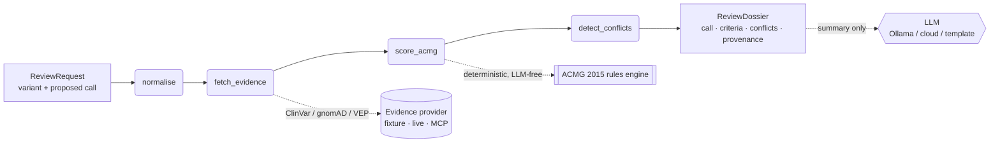

# Reviewer2 — Engineering Log

> An honest, detailed account of **what we planned, what we fixed, what we achieved,
> how we achieved it (with code and file-by-file explanations), and what we do next.**
>
> Last updated: 2026-06-06 · Status: **v0.1.0, validated, committed locally (not on GitHub)**

---

## Table of contents

1. [TL;DR](#1-tldr)
2. [The plan — why this project, and why this shape](#2-the-plan--why-this-project-and-why-this-shape)
3. [What we achieved (measured, not claimed)](#3-what-we-achieved-measured-not-claimed)
4. [What we fixed along the way](#4-what-we-fixed-along-the-way)
5. [How it works — architecture](#5-how-it-works--architecture)
6. [File-by-file explanation](#6-file-by-file-explanation)
7. [The headline evaluation: ErrorCatch](#7-the-headline-evaluation-errorcatch)
8. [Design decisions & trade-offs (the "why")](#8-design-decisions--trade-offs-the-why)
9. [Honest limitations](#9-honest-limitations)
10. [What we do next](#10-what-we-do-next)
11. [Appendix — how to reproduce every number here](#11-appendix--how-to-reproduce-every-number-here)

---

## 1. TL;DR

**Reviewer2** is an evidence-grounded *second-reviewer* AI for **germline ACMG/AMP variant
classification**. Given a variant and a proposed classification (e.g. from a curator or an upstream
pipeline), it **independently re-derives** the ACMG call from structured evidence, **grounds every
fired criterion in a literal source quote**, and **flags the specific disagreements** a human should
look at. It does not replace the human reviewer — it makes the human faster and harder to fool.

**Current validated state:**

| Signal | Result |
| --- | --- |
| Test suite | ✅ **19 passing** |
| Lint (`ruff`) | ✅ clean |
| Type-check (`mypy`) | ✅ clean (12 source files) |
| **ErrorCatch eval** | ✅ **8/8 injected errors caught (100%)**, **0/4 false positives (0%)** |
| Offline demo | ✅ runs with **zero API keys, zero cost** |
| Version control | ✅ committed locally (`a4e1d88`), **no GitHub remote** |

**The differentiator:** unlike happy-path genomics demos, Reviewer2 ships with **ErrorCatch** — an
evaluation harness that injects *known* errors and reports the catch rate **and the false-positive
rate**, honestly.

---

## 2. The plan — why this project, and why this shape

### 2.1 The real goal

The objective was never "a cool demo." It was: **build one flagship artifact that proves I am the
rare candidate who has *both* deep clinical-genomics domain knowledge *and* production agentic-AI
engineering skill.** That combination is the moat — a CS generalist can't fake the ACMG depth, and a
wet-lab geneticist can't fake the LangGraph/MCP/eval engineering.

### 2.2 Why we did NOT build a startup

Before any code, we ran two structured "premortems" (failure-first research) on broader startup
ideas:

- **Idea 1 — "Reasonome"** (agentic multiomics target discovery): killed on discovery that
  well-funded incumbents already own this space (Biomni/Stanford, TxAgent/Harvard, Robin/FutureHouse,
  Google Co-Scientist).
- **Idea 2 — "Referee"** (independent verifier of AI-science claims): also killed — crowded with
  funded players (K-Dense's $2M seed, VerifAI, and others).

**Meta-finding:** the *horizontal* "agentic AI for biology" space is a red ocean for a solo builder.
The winnable move is to go **vertical** into a domain where credibility, not capital, is the moat —
**clinical variant interpretation** — and to **decouple** the job goal (very winnable) from the
startup goal (hard, deferred).

### 2.3 Working backwards from the headline

We wrote the announcement *before* the code (`docs/BLOG_DRAFT.md`). The headline this repo had to
*earn*:

> *"I built a second-reviewer AI for ACMG variant classification — here's a reclassified ClinVar
> call it caught that a static pipeline missed."*

Every feature was then judged by one test: **does it make that sentence true and defensible?** If
not, it was cut.

### 2.4 Scope discipline (deliberately narrow)

We adopted ~90% of a critical review ("cut scope, be honest about metrics, ship something complete
rather than ambitious-but-broken"). Concretely:

| ✅ In v1 | ❌ Cut (and to where) |
| --- | --- |
| Germline **ACMG/AMP** | Somatic AMP/ASCO/CAP tiering → **v2** |
| Transparent **source-quote** grounding | NLI faithfulness model → **v2** |
| Structured evidence (ClinVar / gnomAD / VEP) | RAG-over-PubMed → **v1.1** |
| **Human-in-the-loop** dossier | Autonomous reporting (never the goal) |

**Principle:** *A complete simple repo beats an incomplete ambitious one.*

---

## 3. What we achieved (measured, not claimed)

1. **A working, offline, deterministic second-reviewer pipeline.** `make demo` classifies three
   fixture variants and prints an auditable dossier for each — no API keys, no network, no cost.

2. **A deterministic ACMG 2015 rules engine** that an interviewer can read against the paper, line
   by line (`src/reviewer2/acmg/rules.py`). The LLM **never** makes a classification decision.

3. **"No claim without a source" enforced by the type system.** A Pydantic validator makes it
   *impossible* to mark an ACMG criterion as met without attached evidence, and every evidence item
   carries the literal `source_quote`.

4. **An honest evaluation (ErrorCatch).** 8 injected errors + 4 controls; **100% catch, 0% false
   positives**, broken down by error type and pinned by a test.

5. **Reproducible provenance.** Every dossier carries a `provenance_hash`; identical inputs produce
   an identical hash (enforced by a test).

6. **Breadth of in-demand skills, each in a real place:** LangGraph orchestration, provider-agnostic
   LLM (Ollama default + cloud + deterministic fallback), an MCP server, a Typer+Rich CLI, and a
   clean `uv`/`ruff`/`mypy`/`pytest` toolchain.

7. **Green across the board:** 19 tests, ruff clean, mypy clean, committed locally with the lockfile
   for reproducibility.

---

## 4. What we fixed along the way

These are the real bugs and rough edges we found and fixed during validation — included because the
*fixes themselves* are part of the story an interviewer cares about.

### 4.1 The "crying wolf" false positive (the important one)

**Symptom:** The first ErrorCatch run reported **25% false positives (1/4 controls)**. The offending
control: a curator proposed **Pathogenic**; Reviewer2 independently called **Likely pathogenic**.

**Root cause:** the conflict logic raised a review-blocking `CLASSIFICATION_DISAGREEMENT` on *any*
difference between the proposed and independent calls — even a one-tier difference where **both calls
sit on the same clinical side** (P and LP lead to the *same* management). Worse, our LP call was an
artifact of our own deliberately conservative PVS1 cap, so we were flagging *our own conservatism* as
if it were the human's error.

**Fix:** introduced the concept of **clinical action bands** — `act` (P/LP), `monitor` (VUS),
`don't-act` (B/LB). We now only raise a *blocking* disagreement when the two calls fall in
**different** bands. A within-band difference is still recorded (as `INFO`) for completeness, but it
**does not** block sign-off.

```python
# src/reviewer2/acmg/rules.py
_ACTION_BAND = {
    ACMGClassification.BENIGN: 0,            # do not act
    ACMGClassification.LIKELY_BENIGN: 0,     # do not act
    ACMGClassification.VUS: 1,               # monitor
    ACMGClassification.LIKELY_PATHOGENIC: 2, # act
    ACMGClassification.PATHOGENIC: 2,        # act
}

def materially_disagree(a, b) -> bool:
    """True only if two calls fall in different clinical action bands."""
    return _ACTION_BAND[a] != _ACTION_BAND[b]
```

The eval harness was also made **severity-aware**: only conflicts at `MINOR`/`MAJOR`/`CRITICAL`
count as a catch or a false positive; `INFO` notes do not.

**Result:** false-positive rate **25% → 0%**, catch rate unchanged at **100%**. This is now locked
by `tests/test_errorcatch.py` (`assert result["false_positive_rate"] == 0.0`).

> **Why this matters:** the most valuable thing a "reviewer" can do is *not* interrupt a human
> needlessly. Finding and fixing our own false positive is exactly the kind of judgment the role
> demands.

### 4.2 Deprecated `datetime.utcnow()`

`datetime.utcnow()` is deprecated in modern Python and emitted 100+ warnings during tests. Replaced
with a timezone-aware helper:

```python
# src/reviewer2/models.py
def _utcnow() -> datetime:
    """Timezone-aware UTC now (datetime.utcnow() is deprecated in 3.12+)."""
    return datetime.now(timezone.utc)
```

**Result:** warnings gone; clean test output.

### 4.3 A latent summary bug + lint failure

`ruff` flagged an unused variable `top` in `summary.py`. Investigating revealed the intent was to
**sort conflicts by severity** before printing — but the code sorted into an unused variable and then
looped over the *unsorted* list, and even the sort key (`severity.value`, a string) would have
ordered alphabetically rather than by real severity. Fixed to sort by an explicit severity rank,
most-severe first:

```python
# src/reviewer2/summary.py
order = {ConflictSeverity.CRITICAL: 0, ConflictSeverity.MAJOR: 1,
         ConflictSeverity.MINOR: 2, ConflictSeverity.INFO: 3}
ordered = sorted(conflicts, key=lambda c: order.get(c.severity, 99))
```

**Result:** lint clean *and* a real (if small) behavioral bug fixed.

### 4.4 A `mypy` type error in the LLM factory

`mypy` flagged `Item "None" of "str | None" has no attribute "lower"`. The expression
`(provider or os.getenv("REVIEWER2_LLM_PROVIDER", "ollama")).lower()` could, in theory, be `None`.
Restructured so the result is unambiguously a non-empty `str` (this also fixes a latent bug where an
empty-string env var would slip through):

```python
# src/reviewer2/llm.py
provider = (provider or os.getenv("REVIEWER2_LLM_PROVIDER") or "ollama").lower()
```

**Result:** `mypy` clean across all 12 source files.

### 4.5 Build/packaging friction

`uv sync` initially failed because the `pyproject.toml` declared `readme = "README.md"` before the
file existed (Hatchling validates it at build time). Created the README and synced cleanly. We also
chose to **commit `uv.lock`** (initially git-ignored) — reproducibility is the whole theme of the
project, so pinning exact dependency versions is the consistent choice.

---

## 5. How it works — architecture



**The data flow, in one breath:** a `ReviewRequest` is normalised → evidence is fetched from a
provider → the deterministic engine scores ACMG criteria and produces an independent classification →
conflicts are detected against the proposed call → everything is packaged into an auditable
`ReviewDossier` (criteria + source quotes + conflicts + provenance hash), with an optional LLM step
that *only* polishes the human-readable summary.

**The four load-bearing ideas:**

1. **Deterministic, LLM-free core** → reproducible & auditable classification.
2. **No claim without a source** → enforced by a Pydantic validator.
3. **Provenance + determinism** → same inputs ⇒ same `provenance_hash`.
4. **Actionable, severity-graded conflicts** → the human sees exactly what to check.

---

## 6. File-by-file explanation

### Core library — `src/reviewer2/`

#### `models.py` — the typed domain (the spine)

Every object that flows through the pipeline is a Pydantic v2 model. This is both a senior-engineering
signal and a correctness tool. Key types:

- **`Variant`** — a germline small variant keyed on the VCF 5-tuple `(genome, chrom, pos, ref, alt)`;
  carries HGVS/rsID for readability. `.key` gives a stable, hashable identity used for caching and
  provenance.
- **`EvidenceItem`** — the load-bearing model. `source_quote` is the literal sentence/value from the
  source so a human can verify the claim without trusting the model. `retrieved_at` +
  `source_last_updated` power the **staleness** check via `staleness_days()`.
- **`ACMGCriterion`** — one criterion evaluation (PVS1, PM2, BA1, …). **The critical bit:**

  ```python
  @model_validator(mode="after")
  def _no_fired_criterion_without_evidence(self):
      if self.met and not self.evidence:
          raise ValueError(f"Criterion {self.code} is marked met=True but carries no evidence.")
      return self
  ```

  This makes "no claim without a source" a *type-system guarantee*, not a convention.
- **`ConflictFlag`** / `ConflictType` / `ConflictSeverity` — the structured "second reviewer
  disagrees" output (4 severities: INFO < MINOR < MAJOR < CRITICAL).
- **`ReviewRequest`** / **`ReviewDossier`** — the input and the auditable output. The dossier holds
  the independent call, all criteria, conflicts, `disagreement_score`, summary, `engine_version`, and
  `provenance_hash`, plus convenience properties (`fired_criteria`, `has_major_conflict`).

#### `acmg/rules.py` — the deterministic ACMG 2015 combining rules (LLM-free)

Pure, typed functions implementing Richards et al. (2015) **Table 5**. Reads like the paper:

- `_counts()` tallies fired criteria into buckets (PVS/PS/PM/PP/BA/BS/BP).
- `_is_pathogenic()`, `_is_likely_pathogenic()`, `_is_benign()`, `_is_likely_benign()` encode the
  exact combining rules.
- `classify()` returns the 5-tier call; **contradictory evidence (both pathogenic and benign rules
  fire) → VUS**, matching the guideline's intent.
- `disagreement_score()` — normalised 0–1 distance on the ordinal 5-tier scale.
- `crosses_clinical_actionability()` — P/LP vs B/LB flip detection.
- **`materially_disagree()`** + `_ACTION_BAND` — the action-band logic from the [§4.1 fix](#41-the-crying-wolf-false-positive-the-important-one).
- `ENGINE_VERSION = "acmg-2015-rules/0.1.0"` — stamped into every dossier for provenance.

#### `acmg/scorer.py` — evidence → fired criteria

Maps structured evidence to specific ACMG criteria, **honestly scoped** to what public data can
defensibly support:

| Criterion | Fires when | Strength |
| --- | --- | --- |
| **PVS1** | null consequence (frameshift/stop/splice…) in a LoF-intolerant gene | **Supporting** (capped per ClinGen SVI — we can't confirm transcript context, so we err toward caution) |
| **PS1** | ClinVar reports same amino-acid change as a known pathogenic variant | Strong |
| **PM2** | gnomAD allele frequency `< 1e-4` | Supporting (SVI down-weight) |
| **PP3 / BP4** | ensemble in-silico score `≥0.7` / `≤0.3` | Supporting |
| **BA1** | allele frequency `> 5%` | Stand-alone benign |
| **BS1** | `1% < AF ≤ 5%` | Strong |

It deliberately **does not** implement PS3/BS3 (functional), PM3/PP1/BS4 (segregation), PM6/PS2 (de
novo), PP4 (phenotype) — these need data no public API provides, and the file says so. It also
returns **non-fired** criteria (met=False) so the dossier shows *what was considered*, not just what
fired. Thresholds are module-level constants so they can be challenged and tuned.

#### `conflicts.py` — the "second reviewer disagrees" logic

`detect_conflicts()` produces specific, severity-graded flags:

1. **Classification disagreement** — only *blocking* when it crosses action bands (uses
   `materially_disagree`); escalated to **CRITICAL** when it crosses the actionability line; recorded
   as **INFO** when within-band.
2. **ClinVar submitter conflict** — ClinVar itself reports conflicting interpretations.
3. **Stale evidence** — ClinVar record older than `STALENESS_THRESHOLD_DAYS = 365` relative to
   retrieval (the "reclassified months ago, still reported as VUS" failure mode).
4. **Missing evidence** — e.g. no gnomAD frequency, so PM2/BA1/BS1 couldn't be assessed (silence is
   never mistaken for benign).

#### `pipeline.py` — the 4-node LangGraph graph

`normalise → fetch_evidence → score_acmg → detect_conflicts → END`. Each node is a pure function of a
shared, typed `ReviewState` (a `TypedDict`). Highlights:

- **Providers are injected** (`build_graph(evidence_provider=…, llm_provider=…)`), so tests and the
  eval run fully offline and deterministic.
- The deterministic template summary is the **source of truth**; the LLM only *polishes* it, and any
  LLM error silently falls back to the template:

  ```python
  if client.model_id == "template":
      summary, summary_source = base_summary, "template"
  else:
      try:
          summary = client.complete(LLM_SYSTEM_PROMPT, base_summary)
          summary_source = client.model_id
      except Exception:
          summary, summary_source = base_summary, "template"
  ```

- `review_variant(request, …)` is the one public entry point used by the CLI, MCP server, and tests.

#### `evidence.py` — pluggable evidence sources

- `EvidenceProvider` **Protocol** (`fetch(variant) -> list[EvidenceItem]`).
- `FixtureEvidenceProvider` — offline default; reads `eval/fixtures/evidence.json`.
- `LiveEvidenceProvider` — an **honest stub** marking exactly where real ClinVar/gnomAD/VEP calls plug
  in (v1.1).
- `get_evidence_provider()` factory chooses by name/env var.

#### `llm.py` — provider-agnostic, never-crashes LLM layer

- `LLMClient` Protocol; `TemplateClient` (deterministic), `OllamaClient` (local default),
  `AnthropicClient`, `OpenAIClient`, `GeminiClient`.
- `get_llm_client(provider)` reads `REVIEWER2_LLM_PROVIDER` and **degrades gracefully** to the
  template on any error (missing key, Ollama not running, etc.) — the demo always runs.

#### `summary.py` — deterministic prose + provenance

- `render_template_summary()` — a faithful, deterministic paragraph from the structured dossier.
- `provenance_hash()` — `sha256[:16]` over (variant, evidence fingerprint, fired criteria, engine
  version). Identical inputs ⇒ identical hash.
- `LLM_SYSTEM_PROMPT` — instructs the model to improve clarity only and **not add/remove/change any
  facts, numbers, or classifications.**

#### `normalise.py` — deterministic variant normalisation

Strips `chr` prefixes, uppercases alleles, left-trims indels. Pure/offline so the provenance hash is
stable.

#### `cli.py` — Typer + Rich interface

- `reviewer2 review …` — review a single variant (with `--proposed`, `--llm`, `--json`).
- `reviewer2 demo` — run the three bundled fixture cases offline (default `--llm none`).
- `_render()` paints the dossier as Rich panels/tables — the terminal output *is* the README
  screenshot. The three demo cases are chosen to show: an under-call (BRCA1, VUS→LP), an
  actionability flip (PCSK9, LP→LB), and a stale-evidence + over-call (BRCA2, VUS→Benign, 818-day-old
  ClinVar record).

### Evaluation — `eval/`

- **`errorcatch.py`** — the headline harness. Loads the test set (with inline evidence), runs each
  case through `review_variant`, and computes **catch rate** (by error type) and **false-positive
  rate** (on controls). Severity-aware: only blocking conflicts count. Writes
  `eval/results/errorcatch.json` and prints Rich tables.
- **`errorcatch_testset.json`** — 12 hand-curated cases: 8 injected errors
  (`stale_clinvar`×2, `clinvar_submitter_conflict`, `overcall_benign_common`×2,
  `undercall_pathogenic_null`×2, `wrong_direction_insilico`) + 4 controls. Each case is fully
  self-contained (carries its own evidence + `expected_truth` + `is_injected_error`).
- **`fixtures/evidence.json`** — evidence for the three demo variants.

### Interop — `mcp_server/server.py`

A standalone **FastMCP** server exposing two tools — `get_evidence` and `review_variant_tool` — so any
MCP-aware agent (Claude Desktop, etc.) can call Reviewer2. Optional (`uv sync --extra mcp`).

### Tests — `tests/`

- **`test_rules.py`** — pins ACMG Table 5 combinations (e.g. PVS1+PS1 ⇒ Pathogenic), disagreement
  score endpoints, and actionability crossing.
- **`test_pipeline.py`** — proves the headline behaviours: the no-evidence `ValidationError`, BA1/PM2/
  PVS1 firing, **stale ClinVar flagging**, over-call disagreement, and **deterministic provenance
  hash**.
- **`test_errorcatch.py`** — asserts catch rate ≥ 0.75 and **false-positive rate == 0.0**.

### Project files

- `pyproject.toml` — `uv`/Hatchling config; lean core deps; optional extras (`live`, `mcp`, `app`,
  `anthropic`, `openai`, `gemini`, `cloud`, `dev`); `reviewer2` script entry; ruff/pytest/mypy config.
- `Makefile` — `install/sync`, `demo`, `eval`, `test`, `lint`, `typecheck`, `check`, `mcp`, `app`,
  `clean` — all offline-capable.
- `README.md` — the recruiter-facing centerpiece (pitch, demo, ErrorCatch numbers, architecture,
  skills table, scope, quickstart).
- `docs/BLOG_DRAFT.md` — the working-backwards brief (and the placeholder for the **real failure
  story** only the author can supply).
- `LICENSE` — MIT. `.gitignore`, `.env.example`, `uv.lock` (committed for reproducibility).

---

## 7. The headline evaluation: ErrorCatch

**Definitions (stated plainly so they can be interrogated):**

- A case is **caught** if Reviewer2 raises a *blocking* conflict (severity ≥ MINOR) on a case where
  `is_injected_error == true`.
- **Catch rate** = caught / injected errors, reported overall and per error type.
- **False-positive rate** = controls wrongly flagged with a blocking disagreement / number of
  controls.

**Results (`eval/results/errorcatch.json`, regenerated by `make eval`):**

```text
ErrorCatch — 8/8 injected errors caught (catch rate 100%);
            false-positive rate 0% on 4 controls.
```

| Error type | Caught | Simulates |
| --- | :---: | --- |
| `stale_clinvar` | 2 / 2 | a call made before ClinVar reclassified the variant |
| `clinvar_submitter_conflict` | 1 / 1 | submitters disagree; a single call hides it |
| `overcall_benign_common` | 2 / 2 | a common (high-AF) variant called pathogenic |
| `undercall_pathogenic_null` | 2 / 2 | a LoF variant in a known gene called VUS/benign |
| `wrong_direction_insilico` | 1 / 1 | in-silico evidence applied in the wrong direction |

**Honesty caveats (stated in the repo, not hidden):** this is a *starter* set — small, hand-curated,
and inspectable. It is a **floor that demonstrates the methodology**, not a published benchmark.
Scaling it to a large, stratified set drawn from real ClinVar conflicts is explicit v1.1 work.

---

## 8. Design decisions & trade-offs (the "why")

| Decision | Why | Trade-off accepted |
| --- | --- | --- |
| **LLM never classifies** (only summarises) | Reproducibility & auditability; a lab can trust a deterministic core | Less "wow" than an end-to-end LLM agent; we think trust > wow here |
| **Transparent source-quote grounding** (not NLI) | A human can verify in one glance; no black box | Doesn't catch subtle paraphrase errors an NLI model might (deferred to v2) |
| **Germline only** | Finish one thing well; somatic tiering is a different rubric | No oncology somatic support yet (v2) |
| **Action-band conflict gating** | Don't cry wolf; mirror real clinical workflow | A within-band difference is INFO-only — intentional |
| **PVS1 capped to Supporting** | ClinGen SVI guidance without confirmed transcript context; err toward caution | May *under*-call some true frameshifts (acceptable for a "flag for review" tool) |
| **`uv` + committed lockfile** | Fast, cheap, reproducible | Slightly unusual vs `pip`/`poetry`, but defensible |
| **Offline-first (fixtures + template)** | Demo/eval run anywhere, free, deterministic | Live data is a stub until v1.1 |

---

## 9. Honest limitations

- **Not a clinical device.** Not validated for diagnostic use; must not drive patient care.
- **Evidence is fixture-based in v1.** Live ClinVar/gnomAD/VEP is a typed stub (v1.1).
- **Partial ACMG coverage.** 6 criteria families implemented; functional/segregation/de-novo criteria
  are out of scope until real data sources are wired in.
- **Small eval set.** 12 cases — methodology-complete, scale-incomplete.
- **The "real failure story" is still a placeholder** in `README.md`/`docs/BLOG_DRAFT.md` — it's the
  one thing only the author (with first-hand clinical-genomics experience) can write, and it's the
  single highest-leverage addition.

---

## 10. What we do next

### Immediate (author-only, highest leverage)

1. **Write the real failure story** — one anonymised, non-confidential reclassification/staleness
   situation seen first-hand. One specific sentence beats every published statistic.
2. **Decide on GitHub** — currently **local only**; when ready, create the repo (private first is
   fine) and push. *(Deferred per the author's request.)*

### v1.1 — make the evidence real

- Implement `LiveEvidenceProvider` against real **ClinVar**, **gnomAD**, and **VEP/Ensembl** APIs
  (the Protocol seam already exists).
- Grow **ErrorCatch** into a larger, stratified set drawn from public ClinVar "conflicting
  interpretation" records; report per-stratum catch rates.
- Optional **Streamlit** UI (the `app` extra is already wired) for a clickable demo.

### v2 — depth

- **Somatic** (AMP/ASCO/CAP) tiering as a parallel rubric.
- An **NLI faithfulness** critic layered *on top of* (not replacing) source-quote grounding.
- Add **PS3/BS3** (functional) and **PM3/PP1/BS4** (segregation) once the corresponding data sources
  are integrated.
- A **human-approval interrupt** node in the graph (LangGraph checkpoint) to model real sign-off.

---

## 11. Appendix — how to reproduce every number here

```bash
cd reviewer2

uv sync                 # create env from the committed lockfile (reproducible)

make test               # -> 19 passed
make lint               # -> ruff: clean
make typecheck          # -> mypy: Success, no issues in 12 source files
make eval               # -> ErrorCatch 8/8 caught (100%), 0/4 false positives (0%)
make demo               # -> 3 auditable dossiers, fully offline

# the eval writes machine-readable results here:
cat eval/results/errorcatch.json
```

Everything above runs **offline, with no API keys and no cost**. To use a real LLM *only* for the
prose summary (classification stays deterministic):

```bash
uv run reviewer2 demo --llm ollama                       # local, free
# or:
uv sync --extra cloud
REVIEWER2_LLM_PROVIDER=anthropic ANTHROPIC_API_KEY=... uv run reviewer2 demo
```

---

*This log is intentionally honest about what is real (a validated, deterministic, well-tested v1) and
what is not yet real (live data, large-scale eval, the author's failure story). That honesty is the
point: it's the same discipline the tool itself applies to variant calls.*
